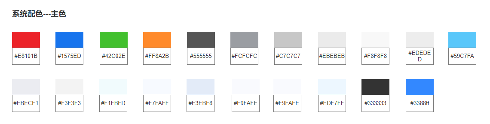
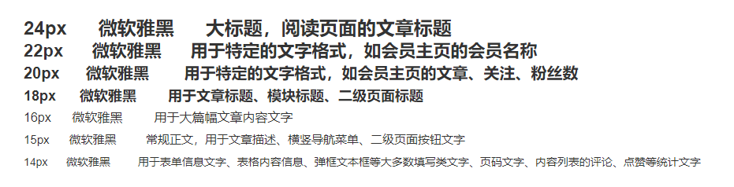
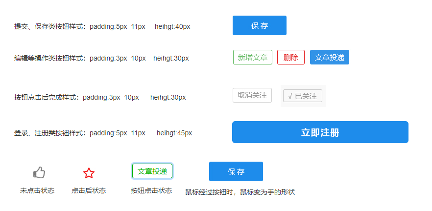
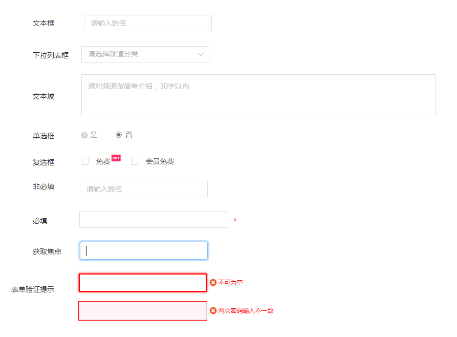
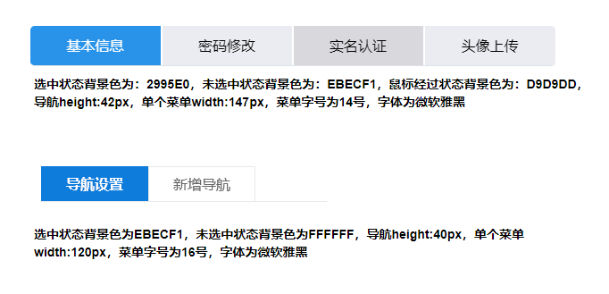
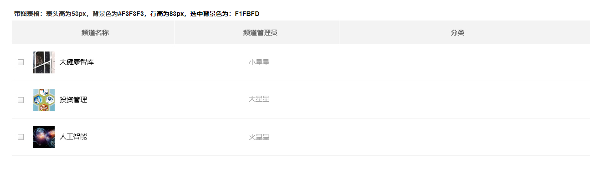
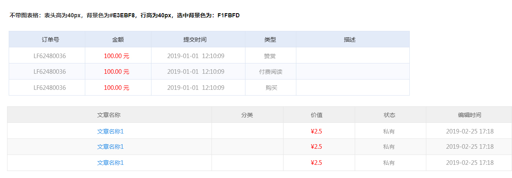

###### TinkBrians Document

# UI页面规范

 

#### 页面文件

*  **default**
    * article.html 【文章阅读页】
    * channel.html 【频道搜索页】
    * channelHome.html 【频道主页】
    * home.html 【主页】
    * login.html 【登录页面】
    * personFocus.html 【TA的关注】
    * personHome.html 【TA的主页】
    * register.html 【注册】
    * result.html 【文章列表页面】
* **member**
    * accountBind.html 【我的账户-帐号绑定】
    * allArtice.html 【频道中心-全部文章】
    * articleReview.html 【文章审核】
    * articleManager.html 【文章管理】
    * channelCenter.html  【频道中心】
    * channelSetting.html 【频道设置】
    * collection.html 【我的账户-我的收藏】
    * complaintManager.html 【频道中心-投诉管理】
    * created_enterprise.html 【创建企业频道】
    * created_managerHome.html 【频道管理主页】
    * created_personal.html 【创建个人频道】
    * created_success.html 【创建频道完成】
    * createdChannel_1.html 【创建频道-1】
    * createdChannel_2.html 【创建频道-2】
    * deletelArtice.html 【频道中心-移除文章】
    * drawMoney.html 【我的账户-提现管理】
    * focusPerson.html 【频道中心-关注的人】
    * friendLink.html 【频道中心-友情链接】
    * memberSpace.html 【会员空间】
    * messages.html 【我的账户-站内消息】
    * myFocus.html 【我的账户-我的关注】
    * myOrder.html 【文章管理-我的订单】
    * navbarManager.html 【频道中心-导航管理】
    * newArticle.html 【文章管理-新增文章】
    * orderManager.html 【频道中心-订单管理】
    * paymentDetails.html 【频道中心-收支明细】
    * paymentInfo.html 【文章管理-收支明细】
    * personal.html 【我的账户-个人资料】
    * sendArtice.html 【频道中心 - 文章发布】
    * themsSetting.html 【频道中心-主题设置】
    * topUp.html 【我的账户-充值管理】
* **tepl**
    * addClass.html 【新增文章分类】
    * addFriendLink.html 【新增友情链接】
    * Alipay.html 【支付宝支付】
    * appreciates.html 【文章赞赏】
    * channel-search.html 【频道中心页面搜索组件】
    * channelSidebar.html 【频道中心侧边栏】
    * delivery.html 【文章投递】
    * fromChannel.html 【所属频道弹窗】
    * memberNavbar.html 【会员空间页面顶部栏】
    * navbar.html 【页面通用顶部栏】
    * review.html 【文章审核】
    * search.html 【页面公用搜索组件】
    * security.html 【安全验证】
    * Wechat.html 【微信支付】

 
 

* * *

### 页面基本规范
 

#### 颜色 Color
> 

* * *

#### 文字 Font
> **中文字体：** `微软雅黑`
> 
> **英文字体：** `Arial`
> 
> **font-family：** `微软雅黑, Arial`
>
>

* * *
#### 按钮 Button

> **提交、保存类按钮样式：** padding:5px 11px   heihgt:40px
> 
> **编辑等操作类按钮样式：** padding:3px 10px   heihgt:30px
> 
> **按钮点击后完成样式：**  padding:3px 10px   heihgt:30px
> 
> **登录、注册类按钮样式：**  padding:5px 11px   heihgt:45px
> 
> 

* * *
#### 表单 Form
> 

* * *
#### 菜单导航 Navbar
> 

* * *

#### 表格 Table

> ##### 带图表格
> 
> 
> ##### 不带图表格
> 
> 

